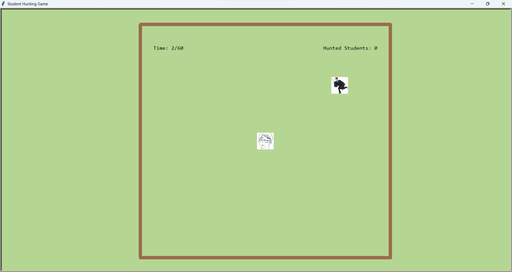

사용자가 교수님을 이동시켜 학생들을 반복해서 사냥하는 게임이다.

4주차에 배웠던 turtle 라이브러리를 이용하여 전체적인 틀과 게임이 진행됨을 구현했다.

 먼저, 게임을 실행시키면 아래와 같이 큰 frame이 생성된다.

 

이 프레임은 게임이 진행되는 울타리 역할도 동시에 한다.

 그 후, 간단한 환영인사와 함께 게임의 정보, 지켜야 할 규칙 등이 Rule 1, 2, 3로 주어진다.

 

<h2>학생 사냥 게임에 오신 것을 환영합니다!!!</h2>

* 규칙 1: 당신은 화살표를 통해 교수님을 움직여 학생을 사냥할 수 있습니다.

* 규칙2: 60초가 지나면 게임은 종료됩니다.

* 규칙3: 울타리 밖으로 벗어나면 게임은 종료됩니다.

5초뒤 게임이 시작됩니다...

 위의 안내사항이 나오고 5초가 지난 뒤, 전부 지워진 후 다음과 같이 학생 개체와, 교수님 개체가 생성된다. 왼쪽 위에는 게임을 시작한 후로부터 경과된 시간이 출력되고, 오른쪽 위에는 게임을 하는 동안 잡은 학생 수가 출력된다.

 

초기에 교수님 개체는 울타리의 중앙에 위치하고, 학생 개체는 생성될 때마다 울타리 안의 랜덤한 위치에 생성된다.

만약 사용자가 화살표 버튼을 통해 교수님을 움직여 학생을 잡는다면, 사냥된 학생 수가 한 명 늘어나고 잡혀진 학생 개체는 사라지게 된다. 또한 새로운 학생 개체가 생성되어 게임이 지속될 수 있도록 한다.

학생 개체에 대하여 설명하겠다. 학생 개체의 이동에 대하여 랜덤한 방향으로 계속해서 움직이도록 했다. 또 울타리 밖으로 벗어나지 못하도록 좌표를 계산해 벗어났을 시 빠르게 돌아오도록 하였다.

게임이 시작되고 60초가 지난 후를 살펴보자.

시간이 종료되었다는 메세지와 함께 몇 명의 학생들을 사냥했는지 결과를 출력하고, 교수 개체와 학생 개체는 전부 사라져 게임이 종료된다.

그렇다면 사용자가 교수님을 움직여 울타리 밖으로 벗어나게 되었을 때는 어떻게 될까?

Rule3를 어겼다는 메세지와 함께 게임이 종료되고, 마찬가지로 교수 개체와 학생 개체가 전부 사라진다.